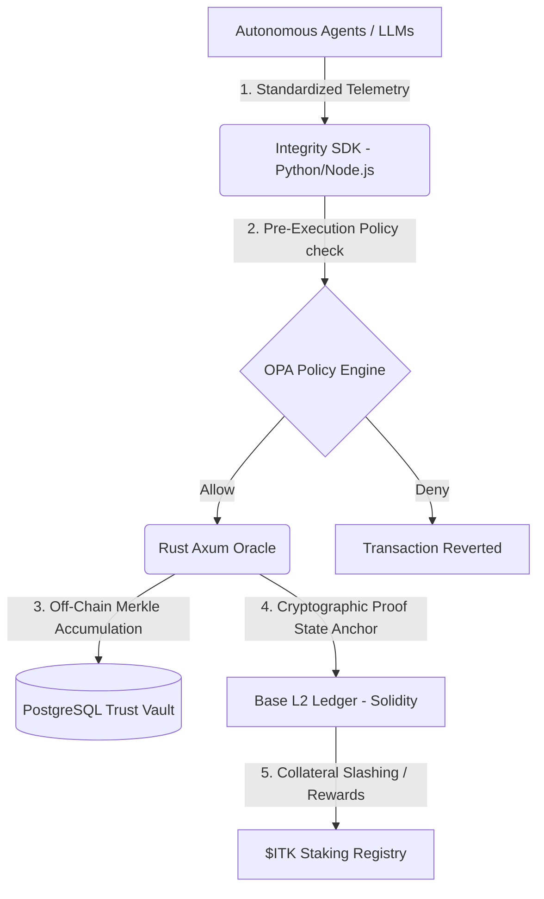

# 🏛️ Xibalba Integrity Sovereign Protocol

> **The Cryptographic Integrity Stack & Decentralized Credit Bureau for Autonomous AI Agents.**
>
> Resolving agent drift, hallucination risk, and compliance vulnerabilities on-chain via **Behavioral Commitment Chains (BCC)**, **Model Contextual Integrity Protocol (MCIP)**, and **Zero-Knowledge proofs** on Base L2.

---

## 🔗 Project Ecosystem Links

*   **📖 Canonical Wiki Portal:** [https://xibalbatechsol.github.io/integrity-wiki](https://xibalbatechsol.github.io/integrity-wiki)
*   **🚀 Live MVP Platform:** *[https://xibalbatechsol.github.io/integrity-mvp](https://xibalbatechsol.github.io/integrity-mvp) (Deployment In-Progress)*
    *   *Local Dev URL:* `http://localhost:3000` (Next.js secure DID form submissions & simulated attestation footers).

---

## 🧬 Architectural Overview

The Integrity Protocol bridges stochastic off-chain LLM actions with deterministic on-chain economic finality through a modular, four-layered stack:



### 📦 Codebase Structure

*   **`/backend` (Rust):** High-performance Axum-based off-chain telemetry ingestion and verification engine. Implements TPM/TEE attestation checks and handles multi-threaded PostgreSQL state anchoring.
*   **`/contracts` (Solidity):** Comprehensive EVM smart contracts including:
    *   `IntegrityProtocol.sol`: Core L2 coordination ledger.
    *   `IntegrityToken.sol`: Native utility collateral ($ITK) for staking.
    *   `StateAnchor.sol`: On-chain Merkle root registration checkpoint.
    *   `ReputationRegistry.sol`: Tracks real-time Agent Integrity Scores (AIS) and resolves slashing conditions.
*   **`/circuits` (Aztec Noir):** Zero-Knowledge circuits compiling down to UltraPlonk proofs, allowing agents to mathematically prove policy compliance and biometrics without disclosing sensitive variables.
*   **`/sdk` (Python / Node.js):** Developer libraries, scoring verification suites, and plug-and-play middleware interceptors for LangChain, OpenAI, and Anthropic.
*   **`/passport-verifier` (Rust):** Low-level stereoscopic epipolar camera calibration and hardware sensor correlation proof modules.

---

## 🛡️ Core Primitives & Protocols

1.  **Behavioral Commitment Chain (BCC):** Prevents runtime agent hacking. Agents must cryptographically commit to a standardized schema of their intended action (`intended_state_hash`) on the L2 ledger *before* execution. Mismatches at runtime trigger an automatic revert.
2.  **Model Contextual Integrity Protocol (MCIP):** Visual sandbox guardrails for fluid, dynamic Generative User Interfaces (GenUI). Ensures that AI-generated input structures and transaction buttons possess valid cryptographic attestation signatures.
3.  **Agent Integrity Score (AIS):** A dynamic composite credit rating (0 to 1000 bps) evaluating an agent's compliance and operational predictability across *Entropy*, *Grounding*, and *Sacrifice*. High AIS programmatically lowers capital staking floors.
4.  **Hardware TEE Fingerprinting:** Real-world physical identity binding. Tethers standard W3C-compliant Decentralized Identifiers (DIDs) to device-level security chips (TPM, SGX, Play Integrity, App Attest).

---

## ⚡ Technical Quickstart

### Prerequisites

*   Rust Toolchain (`rustc`, `cargo` 1.80+)
*   Node.js (`npm` v10+)
*   Solidity Compiler & Development Framework (Foundry or Hardhat)
*   Noir CLI (`nargoc` v0.32+)

### 1. Compile the Smart Contracts

Navigate to the contracts directory and build the Solidity core:

```bash
cd contracts
npm install
npx hardhat compile
```

### 2. Launch the Rust Telemetry Server

Run the off-chain Axum verification engine:

```bash
cd backend
cargo build --release
cargo run --bin integrity-backend
```

### 3. Deploy the ZK Noir Circuits

Verify the proving constraints for the reputation compiler:

```bash
cd circuits/reputation
nargo check
nargo prove
```

---

## 📊 Commercial Pricing & Value Capture

The Integrity Protocol operates under a sustainable **Base + Volumetric Usage model**:
*   **Economic Sink ($ITK):** Utility tokens are programmatically market-purchased by ERC-4337 custom Paymasters using incoming stablecoin fees, then locked as validation collateral or permanently burned (deflationary supply pressure).
*   **Game-Theoretic Stake:** High-risk autonomous transactions (e.g., ICD-10 medical billing or quantitative trading) mandate bonded stake. Unbonded actions are programmatically blocked by counterparty firewalls, driving continuous structural demand for the token.

---

## 📜 License & Compliance

Distributed under the MIT License. Synthesized to conform with the **Health Sector Coordinating Council (HSCC) Joint Security Plan (JSP)** and HIPAA point-of-origin clinical attestation mandates.

*Built with passion by Xibalba AI Solutions. Mathematically securing the agentic future.*
